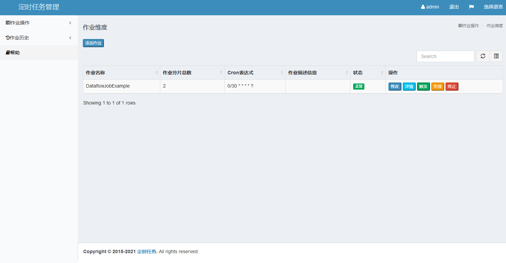

# scheduled-task-spring-boot-starter
分布式定时任务，封装了**elastic-job-lite** & **elastic-job-lite-console**，支持手动触发任务,支持手动添加任务,支持一次性任务.

1. 查看作业以及服务器状态

2. 快捷的修改以及删除作业设置

3. 启用和禁用作业

4. 跨注册中心查看作业

5. 查看作业运行轨迹和运行状态

6. 添加作业，作业不能与自动启动的作业冲突

> **💡提示:** 初始代码Copy自:`https://github.com/number68/scheduled-task`   

## 依赖引入

### 通过Maven的`pom.xml`引入。

```xml
<?xml version="1.0" encoding="UTF-8"?>
<project xmlns="http://maven.apache.org/POM/4.0.0" xmlns:xsi="http://www.w3.org/2001/XMLSchema-instance"
	xsi:schemaLocation="http://maven.apache.org/POM/4.0.0 https://maven.apache.org/xsd/maven-4.0.0.xsd">
	<modelVersion>4.0.0</modelVersion>
	<parent>
		<groupId>org.springframework.boot</groupId>
		<artifactId>spring-boot-starter-parent</artifactId>
		<version>2.4.12</version>
		<relativePath/> <!-- lookup parent from repository -->
	</parent>
	<groupId>org.wjw.job</groupId>
	<artifactId>testscheduledtask</artifactId>
	<version>1.0.0</version>
	
	<name>TestScheduledTask</name>
	<description>test scheduledtask</description>
	
	<properties>
		<java.version>1.8</java.version>
        <elastic-job.version>2.1.5</elastic-job.version>
        <mysql.version>5.1.49</mysql.version>
	</properties>
	
	<dependencies>
		<dependency>
			<groupId>org.springframework.boot</groupId>
			<artifactId>spring-boot-starter-thymeleaf</artifactId>
		</dependency>
		<dependency>
			<groupId>org.springframework.boot</groupId>
			<artifactId>spring-boot-starter-web</artifactId>
		</dependency>

		<dependency>
			<groupId>mysql</groupId>
			<artifactId>mysql-connector-java</artifactId>
			<scope>runtime</scope>
		</dependency>
		<dependency>
			<groupId>org.springframework.boot</groupId>
			<artifactId>spring-boot-starter-tomcat</artifactId>
			<scope>provided</scope>
		</dependency>
		<dependency>
			<groupId>org.springframework.boot</groupId>
			<artifactId>spring-boot-starter-test</artifactId>
			<scope>test</scope>
		</dependency>
		
        <dependency>
            <groupId>org.springframework.boot</groupId>
            <artifactId>spring-boot-starter-aop</artifactId>
        </dependency>
        <dependency>
            <groupId>org.springframework.boot</groupId>
            <artifactId>spring-boot-starter-jdbc</artifactId>
        </dependency>
        <dependency>
            <groupId>com.dangdang</groupId>
            <artifactId>elastic-job-lite-core</artifactId>
            <version>${elastic-job.version}</version>
        </dependency>
        <dependency>
            <groupId>com.dangdang</groupId>
            <artifactId>elastic-job-lite-spring</artifactId>
            <version>${elastic-job.version}</version>
        </dependency>
        <dependency>
            <groupId>com.github.wjw465150</groupId>
            <artifactId>scheduled-task-spring-boot-starter</artifactId>
            <version>2.1.6</version>
        </dependency>
		
	</dependencies>

	<build>
		<plugins>
			<plugin>
				<groupId>org.springframework.boot</groupId>
				<artifactId>spring-boot-maven-plugin</artifactId>
			</plugin>
		</plugins>
	</build>

</project>

```


### 或者通过Gradle的`build.gradle`引入

```groovy
plugins {
  id 'org.springframework.boot' version '2.4.12'
  id 'io.spring.dependency-management' version '1.0.11.RELEASE'
  id 'java'
  id 'war'
}

// jar包的名字
archivesBaseName = 'scheduled-task-test'

ext {
  mysql = [version : '5.1.49']
  elasticjob = [version : '2.1.5']
}

group = 'org.wjw.starter.test'
version = '1.0.0'
sourceCompatibility = '1.8'
targetCompatibility = '1.8'
[compileJava, compileTestJava]*.options*.encoding = 'UTF-8'

repositories {
  mavenLocal()
  maven { url "http://maven.aliyun.com/nexus/content/groups/public/" }  //优先使用阿里的镜像
  mavenCentral()
}

dependencies {
  implementation 'org.springframework.boot:spring-boot-starter-web'
  providedRuntime 'org.springframework.boot:spring-boot-starter-tomcat'

  //启用AOP
  implementation 'org.springframework.boot:spring-boot-starter-aop'

  //使用thymeleaf模板
  implementation 'org.springframework.boot:spring-boot-starter-thymeleaf'

  implementation "org.springframework.boot:spring-boot-starter-jdbc"
  runtimeOnly "mysql:mysql-connector-java:${mysql.version}"

  //集成:elasticjob-lite 2
  implementation "com.dangdang:elastic-job-lite-core:${elasticjob.version}"
  implementation "com.dangdang:elastic-job-lite-spring:${elasticjob.version}"
  
  implementation group: 'com.github.wjw465150', name: 'scheduled-task-spring-boot-starter', version: '2.1.5'
}

```

## 编写SpringBoot的启动类

```java
package TestScheduledTask
  
import org.slf4j.Logger;
import org.slf4j.LoggerFactory;
import org.springframework.boot.SpringApplication;
import org.springframework.boot.autoconfigure.SpringBootApplication;
import org.springframework.boot.web.servlet.ServletComponentScan;
import org.springframework.context.annotation.EnableAspectJAutoProxy;

@SpringBootApplication
public class ScheduledTaskApplication {
  private static final Logger log = LoggerFactory.getLogger(ScheduledTaskApplication.class);

  public static void main(String[] args) {
    SpringApplication.run(ScheduledTaskApplication.class, args);

    log.info("------------scheduled-task started successfully-------------");
  }

}

```

## 编写一个SimpleJob类来测试:

```java
package TestScheduledTask.job;

import org.slf4j.Logger;
import org.slf4j.LoggerFactory;

import com.cloud.task.annotation.ScheduledTask;
import com.dangdang.ddframe.job.api.ShardingContext;
import com.dangdang.ddframe.job.api.simple.SimpleJob;

/**
 * SimpleJob类型的的例子
 * @author White Stone
 *
 * 2021年12月14日
 */
@ScheduledTask(name = "SimpleJobExample", cron = "0/30 * * * * ?", shardingTotalCount = 3, shardingItemParameters="0=Beijing,1=Shanghai,2=Guangzhou", overwrite = true)
public class SimpleJobExample implements SimpleJob {
  private final Logger logger = LoggerFactory.getLogger(this.getClass());

  @Override
  public void execute(ShardingContext shardingContext) {
    //打印出任务相关信息，JobParameter用于传递任务的ID
    logger.info("JobName：{}, ShardingTotalCount：{}, JobParameter={}, ShardingItem: {}, ShardingParameter: {}",
        shardingContext.getJobName(),
        shardingContext.getShardingTotalCount(),
        shardingContext.getJobParameter(),
        shardingContext.getShardingItem(),
        shardingContext.getShardingParameter()
        );
  }
}

```

## 编写application配置文件`application.yml`

```yaml
spring:
  application:
    name: scheduled-task
    
server:
  port: 8090

logging:
  level:
    root: info    

--- 
spring:
  datasource:
    driver-class-name: com.mysql.jdbc.Driver
    url: jdbc:mysql://localhost:3306/scheduled-task?useSSL=false&serverTimezone=Asia/Shanghai&allowPublicKeyRetrieval=true&characterEncoding=UTF-8
    username: root
    password: 11111111 
    hikari:
      minimum-idle: 5
      maximum-pool-size: 10
      
#控制台认证      
auth:
  username: admin
  password: 123456

#连接到zookeeper的配置
zookeeper:
  serviceLists: 127.0.0.1:2181
  namespace: scheduled-task
  baseSleepTimeMilliseconds: 5000
  maxSleepTimeMilliseconds: 5000
  maxRetries: 3

scheduledTask:
  #定时任务监控预警
  monitor:
    enable: true
    time:
      interval: 3

```

## 启动:

运行启动类`ScheduledTaskApplication`启动项目

输出如下:

```bash
!!!!!!=================Spring DefaultProfiles:[default]=================!!!!!!
!!!!!!=================Spring ActiveProfiles:[dev]=================!!!!!!

  .   ____          _            __ _ _
 /\\ / ___'_ __ _ _(_)_ __  __ _ \ \ \ \
( ( )\___ | '_ | '_| | '_ \/ _` | \ \ \ \
 \\/  ___)| |_)| | | | | || (_| |  ) ) ) )
  '  |____| .__|_| |_|_| |_\__, | / / / /
 =========|_|==============|___/=/_/_/_/
 :: Spring Boot ::               (v2.4.12)

2021-12-14 20:09:11.519 [main] INFO  TestScheduledTask.TestApplication - [logStarting,55] - Starting TestApplication using Java 1.8.0_301 on WJW-T14 with PID 21332 (C:\WJW_Z\eclipse_scheduled-task\scheduled-task\scheduled-task-test\bin\main started by 86189 in C:\WJW_Z\eclipse_scheduled-task\scheduled-task\scheduled-task-test)
2021-12-14 20:09:11.522 [main] INFO  TestScheduledTask.TestApplication - [logStartupProfileInfo,668] - The following profiles are active: dev
2021-12-14 20:09:12.421 [main] INFO  o.s.boot.web.embedded.tomcat.TomcatWebServer - [initialize,108] - Tomcat initialized with port(s): 8090 (http)
2021-12-14 20:09:12.431 [main] INFO  org.apache.coyote.http11.Http11NioProtocol - [log,173] - Initializing ProtocolHandler ["http-nio-8090"]
2021-12-14 20:09:12.431 [main] INFO  org.apache.catalina.core.StandardService - [log,173] - Starting service [Tomcat]
2021-12-14 20:09:12.431 [main] INFO  org.apache.catalina.core.StandardEngine - [log,173] - Starting Servlet engine: [Apache Tomcat/9.0.54]
2021-12-14 20:09:12.502 [main] INFO  o.a.c.core.ContainerBase.[Tomcat].[localhost].[/] - [log,173] - Initializing Spring embedded WebApplicationContext
2021-12-14 20:09:12.503 [main] INFO  o.s.b.w.s.c.ServletWebServerApplicationContext - [prepareWebApplicationContext,289] - Root WebApplicationContext: initialization completed in 946 ms
2021-12-14 20:09:12.553 [main] INFO  c.c.t.f.TaskAuthFilter$$EnhancerBySpringCGLIB$$cc147867 - [init,41] - AuthFilter init.
2021-12-14 20:09:12.553 [main] INFO  com.cloud.task.filter.TaskAuthFilter - [init,41] - AuthFilter init.
2021-12-14 20:09:12.653 [main] INFO  o.a.curator.framework.imps.CuratorFrameworkImpl - [start,235] - Starting
2021-12-14 20:09:12.682 [main] INFO  org.apache.zookeeper.ZooKeeper - [logEnv,100] - Client environment:zookeeper.version=3.4.6-1569965, built on 02/20/2014 09:09 GMT
2021-12-14 20:09:12.682 [main] INFO  org.apache.zookeeper.ZooKeeper - [logEnv,100] - Client environment:host.name=192.168.67.157
2021-12-14 20:09:12.682 [main] INFO  org.apache.zookeeper.ZooKeeper - [logEnv,100] - Client environment:java.version=1.8.0_301
2021-12-14 20:09:12.682 [main] INFO  org.apache.zookeeper.ZooKeeper - [logEnv,100] - Client environment:java.vendor=Oracle Corporation
2021-12-14 20:09:12.683 [main] INFO  org.apache.zookeeper.ZooKeeper - [logEnv,100] - Client environment:java.home=C:\WJW_E\WJW_APP\PStart\jdk1.8\jre
2021-12-14 20:09:12.683 [main] INFO  org.apache.zookeeper.ZooKeeper - [logEnv,100] - Client environment:java.class.path=C:\WJW_Z\eclipse_scheduled-task\scheduled-task\scheduled-task-test\bin\main;\scheduled-task-spring-boot-starter\bin\default;C:\WJW_Z\eclipse_scheduled-task\scheduled-task\scheduled-task-spring-boot-starter\bin\main;C:\WJW_Z\GRADLE_USER_HOME\caches\modules-2\files-2.1\org.springframework.boot\spring-boot-starter-web\2.4.12\838c3ed68679e58b7b8550dfde09085dea48b1ef\spring-boot-starter-web-2.4.12.jar;C:\WJW_Z\GRADLE_USER_HOME\caches\modules-2\files-2.1\org.springframework.boot\spring-boot-starter-aop\2.4.12\d51c5caa90a223e61c609ea2d1cf52fbb7dbf667\spring-boot-starter-aop-2.4.12.jar;C:\WJW_Z\GRADLE_USER_HOME\caches\modules-2\files-2.1\org.springframework.boot\spring-boot-starter-thymeleaf\2.4.12\7f3839b22389cced034d176d69f0dca47b56ba9a\spring-boot-starter-thymeleaf-2.4.12.jar;C:\WJW_Z\GRADLE_USER_HOME\caches\modules-2\files-2.1\com.dangdang\elastic-job-lite-spring\2.1.5\f431b9890c3ce6d25e4c5a22460c09967cbd289a\elastic-job-lite-spring-2.1.5.jar;C:\WJW_Z\GRADLE_USER_HOME\caches\modules-2\files-2.1\com.dangdang\elastic-job-lite-core\2.1.5\7289ddc40802d6efd84cc8422b4c142b640239fe\elastic-job-lite-core-2.1.5.jar;C:\WJW_Z\GRADLE_USER_HOME\caches\modules-2\files-2.1\com.dangdang\elastic-job-common-core\2.1.5\905d506431554c25050a834b26e0a50841ede8a0\elastic-job-common-core-2.1.5.jar;C:\WJW_Z\GRADLE_USER_HOME\caches\modules-2\files-2.1\org.apache.curator\curator-recipes\2.10.0\cb9b33e681f454f90187bcab84fd04caa389531c\curator-recipes-2.10.0.jar;C:\WJW_Z\GRADLE_USER_HOME\caches\modules-2\files-2.1\org.apache.curator\curator-framework\2.10.0\36d7e75b255bed25befe3af11aa9241a87908b76\curator-framework-2.10.0.jar;C:\WJW_Z\GRADLE_USER_HOME\caches\modules-2\files-2.1\org.apache.curator\curator-client\2.10.0\ab16e36385e80b162595a0019718e7a305df2d7a\curator-client-2.10.0.jar;C:\WJW_Z\GRADLE_USER_HOME\caches\modules-2\files-2.1\org.apache.zookeeper\zookeeper\3.4.6\1b2502e29da1ebaade2357cd1de35a855fa3755\zookeeper-3.4.6.jar;C:\WJW_Z\GRADLE_USER_HOME\caches\modules-2\files-2.1\log4j\log4j\1.2.17\5af35056b4d257e4b64b9e8069c0746e8b08629f\log4j-1.2.17.jar;C:\WJW_Z\GRADLE_USER_HOME\caches\modules-2\files-2.1\org.springframework.boot\spring-boot-starter-jdbc\2.4.12\aec5a219fc71e59e12f0bda083f77c0b5d48ec49\spring-boot-starter-jdbc-2.4.12.jar;C:\WJW_Z\GRADLE_USER_HOME\caches\modules-2\files-2.1\io.springfox\springfox-swagger2\2.9.2\362676bc7f4c6f9f1d568741becab0dfc198c898\springfox-swagger2-2.9.2.jar;C:\WJW_Z\GRADLE_USER_HOME\caches\modules-2\files-2.1\io.springfox\springfox-swagger-ui\2.9.2\d542382a88ff3ea8d4032c28b2b0325797fada7d\springfox-swagger-ui-2.9.2.jar;C:\WJW_Z\GRADLE_USER_HOME\caches\modules-2\files-2.1\commons-codec\commons-codec\1.12\47a28ef1ed31eb182b44e15d49300dee5fadcf6a\commons-codec-1.12.jar;C:\WJW_Z\GRADLE_USER_HOME\caches\modules-2\files-2.1\org.springframework.boot\spring-boot-starter-json\2.4.12\a9724839c8bf9fe47922888b02819c239c1616c0\spring-boot-starter-json-2.4.12.jar;C:\WJW_Z\GRADLE_USER_HOME\caches\modules-2\files-2.1\org.springframework.boot\spring-boot-starter\2.4.12\8fd8a5ba24cedb4b9d0a410b6dd9d697ef35d3a1\spring-boot-starter-2.4.12.jar;C:\WJW_Z\GRADLE_USER_HOME\caches\modules-2\files-2.1\org.springframework.boot\spring-boot-starter-tomcat\2.4.12\50a25cb9da987abdb54431876c88246b8d895b87\spring-boot-starter-tomcat-2.4.12.jar;c:\WJW_Z\maven_repository\org\springframework\spring-webmvc\5.3.12\spring-webmvc-5.3.12.jar;c:\WJW_Z\maven_repository\org\springframework\spring-web\5.3.12\spring-web-5.3.12.jar;C:\WJW_Z\GRADLE_USER_HOME\caches\modules-2\files-2.1\io.springfox\springfox-swagger-common\2.9.2\b38a41b3044af80cb7f41f67be5d158c9f6491ec\springfox-swagger-common-2.9.2.jar;C:\WJW_Z\GRADLE_USER_HOME\caches\modules-2\files-2.1\io.springfox\springfox-spring-web\2.9.2\ed2ed714a6cba8804d00f80f0534901e4c7a3211\springfox-spring-web-2.9.2.jar;C:\WJW_Z\GRADLE_USER_HOME\caches\modules-2\files-2.1\io.springfox\springfox-schema\2.9.2\e268f38774b16bb51a92ccaef0dcf3dc651c0cee\springfox-schema-2.9.2.jar;C:\WJW_Z\GRADLE_USER_HOME\caches\modules-2\files-2.1\io.springfox\springfox-spi\2.9.2\6ac686190a6ceaccdae8b50d03b0501d144a6666\springfox-spi-2.9.2.jar;C:\WJW_Z\GRADLE_USER_HOME\caches\modules-2\files-2.1\io.springfox\springfox-core\2.9.2\2e26f58939c594fb5c958c3a1c7bedf83d2f2702\springfox-core-2.9.2.jar;c:\WJW_Z\maven_repository\org\springframework\plugin\spring-plugin-metadata\1.2.0.RELEASE\spring-plugin-metadata-1.2.0.RELEASE.jar;c:\WJW_Z\maven_repository\org\springframework\plugin\spring-plugin-core\1.2.0.RELEASE\spring-plugin-core-1.2.0.RELEASE.jar;C:\WJW_Z\GRADLE_USER_HOME\caches\modules-2\files-2.1\org.springframework.boot\spring-boot-autoconfigure\2.4.12\10482e8e391378ff88017a33b29b8c4116d4b68f\spring-boot-autoconfigure-2.4.12.jar;C:\WJW_Z\GRADLE_USER_HOME\caches\modules-2\files-2.1\org.springframework.boot\spring-boot\2.4.12\3f5d44488febe60a27eb4566d855665b573d45be\spring-boot-2.4.12.jar;c:\WJW_Z\maven_repository\org\springframework\spring-context\5.3.12\spring-context-5.3.12.jar;c:\WJW_Z\maven_repository\org\springframework\spring-aop\5.3.12\spring-aop-5.3.12.jar;c:\WJW_Z\maven_repository\org\aspectj\aspectjweaver\1.9.7\aspectjweaver-1.9.7.jar;c:\WJW_Z\maven_repository\org\thymeleaf\thymeleaf-spring5\3.0.12.RELEASE\thymeleaf-spring5-3.0.12.RELEASE.jar;c:\WJW_Z\maven_repository\org\thymeleaf\extras\thymeleaf-extras-java8time\3.0.4.RELEASE\thymeleaf-extras-java8time-3.0.4.RELEASE.jar;C:\WJW_Z\GRADLE_USER_HOME\caches\modules-2\files-2.1\com.google.guava\guava\20.0\89507701249388e1ed5ddcf8c41f4ce1be7831ef\guava-20.0.jar;c:\WJW_Z\maven_repository\com\zaxxer\HikariCP\3.4.5\HikariCP-3.4.5.jar;C:\WJW_Z\GRADLE_USER_HOME\caches\modules-2\files-2.1\io.swagger\swagger-models\1.5.20\fb3a23bad80c5ed84db9dd150db2cba699531458\swagger-models-1.5.20.jar;c:\WJW_Z\maven_repository\org\thymeleaf\thymeleaf\3.0.12.RELEASE\thymeleaf-3.0.12.RELEASE.jar;c:\WJW_Z\maven_repository\org\quartz-scheduler\quartz\2.3.2\quartz-2.3.2.jar;C:\WJW_Z\GRADLE_USER_HOME\caches\modules-2\files-2.1\org.springframework.boot\spring-boot-starter-logging\2.4.12\39ca8d8b6add6b48e9632635d922a0f047a48e38\spring-boot-starter-logging-2.4.12.jar;c:\WJW_Z\maven_repository\ch\qos\logback\logback-classic\1.2.6\logback-classic-1.2.6.jar;c:\WJW_Z\maven_repository\org\apache\logging\log4j\log4j-to-slf4j\2.13.3\log4j-to-slf4j-2.13.3.jar;c:\WJW_Z\maven_repository\org\slf4j\jul-to-slf4j\1.7.32\jul-to-slf4j-1.7.32.jar;c:\WJW_Z\maven_repository\org\slf4j\slf4j-api\1.7.32\slf4j-api-1.7.32.jar;c:\WJW_Z\maven_repository\org\springframework\spring-jdbc\5.3.12\spring-jdbc-5.3.12.jar;C:\WJW_Z\GRADLE_USER_HOME\caches\modules-2\files-2.1\io.swagger\swagger-annotations\1.5.20\16051f93ce11ca489a5313775d825f82fcc2cd6c\swagger-annotations-1.5.20.jar;c:\WJW_Z\maven_repository\com\fasterxml\classmate\1.5.1\classmate-1.5.1.jar;C:\WJW_Z\GRADLE_USER_HOME\caches\modules-2\files-2.1\org.mapstruct\mapstruct\1.2.0.Final\8609d6eb044e9f6c73cb24c8f2f4ed5c72a249c7\mapstruct-1.2.0.Final.jar;c:\WJW_Z\maven_repository\jakarta\annotation\jakarta.annotation-api\1.3.5\jakarta.annotation-api-1.3.5.jar;c:\WJW_Z\maven_repository\org\springframework\spring-tx\5.3.12\spring-tx-5.3.12.jar;c:\WJW_Z\maven_repository\org\springframework\spring-beans\5.3.12\spring-beans-5.3.12.jar;c:\WJW_Z\maven_repository\org\springframework\spring-expression\5.3.12\spring-expression-5.3.12.jar;c:\WJW_Z\maven_repository\org\springframework\spring-core\5.3.12\spring-core-5.3.12.jar;c:\WJW_Z\maven_repository\org\yaml\snakeyaml\1.27\snakeyaml-1.27.jar;c:\WJW_Z\maven_repository\com\fasterxml\jackson\datatype\jackson-datatype-jdk8\2.11.4\jackson-datatype-jdk8-2.11.4.jar;c:\WJW_Z\maven_repository\com\fasterxml\jackson\datatype\jackson-datatype-jsr310\2.11.4\jackson-datatype-jsr310-2.11.4.jar;c:\WJW_Z\maven_repository\com\fasterxml\jackson\module\jackson-module-parameter-names\2.11.4\jackson-module-parameter-names-2.11.4.jar;c:\WJW_Z\maven_repository\com\fasterxml\jackson\core\jackson-databind\2.11.4\jackson-databind-2.11.4.jar;c:\WJW_Z\maven_repository\org\apache\tomcat\embed\tomcat-embed-websocket\9.0.54\tomcat-embed-websocket-9.0.54.jar;c:\WJW_Z\maven_repository\org\apache\tomcat\embed\tomcat-embed-core\9.0.54\tomcat-embed-core-9.0.54.jar;C:\WJW_Z\GRADLE_USER_HOME\caches\modules-2\files-2.1\org.glassfish\jakarta.el\3.0.4\f48473482c0e3e714f87186d9305bcae30b7f5cb\jakarta.el-3.0.4.jar;c:\WJW_Z\maven_repository\com\google\code\gson\gson\2.8.8\gson-2.8.8.jar;c:\WJW_Z\maven_repository\org\apache\commons\commons-lang3\3.11\commons-lang3-3.11.jar;C:\WJW_Z\GRADLE_USER_HOME\caches\modules-2\files-2.1\org.apache.commons\commons-exec\1.3\8dfb9facd0830a27b1b5f29f84593f0aeee7773b\commons-exec-1.3.jar;C:\WJW_Z\GRADLE_USER_HOME\caches\modules-2\files-2.1\jline\jline\0.9.94\99a18e9a44834afdebc467294e1138364c207402\jline-0.9.94.jar;C:\WJW_Z\GRADLE_USER_HOME\caches\modules-2\files-2.1\io.netty\netty\3.7.0.Final\7a8c35599c68c0bf383df74469aa3e03d9aca87\netty-3.7.0.Final.jar;c:\WJW_Z\maven_repository\com\fasterxml\jackson\core\jackson-annotations\2.11.4\jackson-annotations-2.11.4.jar;c:\WJW_Z\maven_repository\org\springframework\spring-jcl\5.3.12\spring-jcl-5.3.12.jar;c:\WJW_Z\maven_repository\com\fasterxml\jackson\core\jackson-core\2.11.4\jackson-core-2.11.4.jar;c:\WJW_Z\maven_repository\org\attoparser\attoparser\2.0.5.RELEASE\attoparser-2.0.5.RELEASE.jar;c:\WJW_Z\maven_repository\org\unbescape\unbescape\1.1.6.RELEASE\unbescape-1.1.6.RELEASE.jar;c:\WJW_Z\maven_repository\com\mchange\mchange-commons-java\0.2.15\mchange-commons-java-0.2.15.jar;c:\WJW_Z\maven_repository\net\bytebuddy\byte-buddy\1.10.22\byte-buddy-1.10.22.jar;c:\WJW_Z\maven_repository\ch\qos\logback\logback-core\1.2.6\logback-core-1.2.6.jar;c:\WJW_Z\maven_repository\org\apache\logging\log4j\log4j-api\2.13.3\log4j-api-2.13.3.jar;c:\WJW_Z\maven_repository\mysql\mysql-connector-java\5.1.49\mysql-connector-java-5.1.49.jar
2021-12-14 20:09:12.684 [main] INFO  org.apache.zookeeper.ZooKeeper - [logEnv,100] - Client environment:java.library.path=C:\WJW_E\WJW_APP\PStart\jdk1.8\bin;C:\WINDOWS\Sun\Java\bin;C:\WINDOWS\system32;C:\WINDOWS;C:/WJW_E/WJW_APP/PStart/eclipse/IDE4.22//plugins/org.eclipse.justj.openjdk.hotspot.jre.full.win32.x86_64_17.0.1.v20211116-1657/jre/bin/server;C:/WJW_E/WJW_APP/PStart/eclipse/IDE4.22//plugins/org.eclipse.justj.openjdk.hotspot.jre.full.win32.x86_64_17.0.1.v20211116-1657/jre/bin;C:\Program Files (x86)\Common Files\Oracle\Java\javapath;C:\Program Files (x86)\VMware\VMware Workstation\bin\;C:\WINDOWS\system32;C:\WINDOWS;C:\WINDOWS\System32\Wbem;C:\WINDOWS\System32\WindowsPowerShell\v1.0\;C:\WINDOWS\System32\OpenSSH\;D:\Python\Python27\Scripts;D:\Python\Python27;D:\Python\Python37\Scripts;D:\Python\Python37;C:\WJW_E\WJW_DATA\OpenSource\Groovy\bin;C:\WJW_E\WJW_APP\PStart\Java\gradle\bin;C:\WJW_E\WJW_APP\PStart\Java\maven3\bin;d:\NodeJS\node-v14.16.1-win-x64;C:\Program Files\dotnet\;c:\Program Files\RabbitMQ Server\rabbitmq_server-3.7.7\sbin;C:\Program Files (x86)\010 Editor;;C:\Program Files (x86)\Gpg4win\..\GnuPG\bin;C:\Users\86189\AppData\Local\Microsoft\WindowsApps;C:\WJW_E\WJW_APP\PStart\eclipse\IDE4.22;;.
2021-12-14 20:09:12.684 [main] INFO  org.apache.zookeeper.ZooKeeper - [logEnv,100] - Client environment:java.io.tmpdir=c:\TEMP\
2021-12-14 20:09:12.684 [main] INFO  org.apache.zookeeper.ZooKeeper - [logEnv,100] - Client environment:java.compiler=<NA>
2021-12-14 20:09:12.684 [main] INFO  org.apache.zookeeper.ZooKeeper - [logEnv,100] - Client environment:os.name=Windows 10
2021-12-14 20:09:12.684 [main] INFO  org.apache.zookeeper.ZooKeeper - [logEnv,100] - Client environment:os.arch=amd64
2021-12-14 20:09:12.684 [main] INFO  org.apache.zookeeper.ZooKeeper - [logEnv,100] - Client environment:os.version=10.0
2021-12-14 20:09:12.684 [main] INFO  org.apache.zookeeper.ZooKeeper - [logEnv,100] - Client environment:user.name=86189
2021-12-14 20:09:12.685 [main] INFO  org.apache.zookeeper.ZooKeeper - [logEnv,100] - Client environment:user.home=C:\Users\86189
2021-12-14 20:09:12.685 [main] INFO  org.apache.zookeeper.ZooKeeper - [logEnv,100] - Client environment:user.dir=C:\WJW_Z\eclipse_scheduled-task\scheduled-task\scheduled-task-test
2021-12-14 20:09:12.685 [main] INFO  org.apache.zookeeper.ZooKeeper - [<init>,438] - Initiating client connection, connectString=127.0.0.1:2181 sessionTimeout=60000 watcher=org.apache.curator.ConnectionState@1cb37ee4
2021-12-14 20:09:12.700 [main-SendThread(127.0.0.1:2181)] INFO  org.apache.zookeeper.ClientCnxn - [logStartConnect,975] - Opening socket connection to server 127.0.0.1/127.0.0.1:2181. Will not attempt to authenticate using SASL (unknown error)
2021-12-14 20:09:12.701 [main-SendThread(127.0.0.1:2181)] INFO  org.apache.zookeeper.ClientCnxn - [primeConnection,852] - Socket connection established to 127.0.0.1/127.0.0.1:2181, initiating session
2021-12-14 20:09:12.706 [main-SendThread(127.0.0.1:2181)] INFO  org.apache.zookeeper.ClientCnxn - [onConnected,1235] - Session establishment complete on server 127.0.0.1/127.0.0.1:2181, sessionid = 0x10000f6a3e30012, negotiated timeout = 60000
2021-12-14 20:09:12.710 [main-EventThread] INFO  o.a.curator.framework.state.ConnectionStateManager - [postState,228] - State change: CONNECTED
2021-12-14 20:09:12.925 [main] INFO  o.s.b.a.web.servlet.WelcomePageHandlerMapping - [<init>,57] - Adding welcome page template: index
2021-12-14 20:09:13.080 [main] INFO  org.apache.coyote.http11.Http11NioProtocol - [log,173] - Starting ProtocolHandler ["http-nio-8090"]
2021-12-14 20:09:13.088 [main] INFO  o.s.boot.web.embedded.tomcat.TomcatWebServer - [start,220] - Tomcat started on port(s): 8090 (http) with context path ''
2021-12-14 20:09:13.096 [main] INFO  TestScheduledTask.TestApplication - [logStarted,61] - Started TestApplication in 1.99 seconds (JVM running for 2.712)
2021-12-14 20:09:13.114 [main] INFO  com.zaxxer.hikari.HikariDataSource - [getConnection,110] - HikariPool-1 - Starting...
2021-12-14 20:09:13.285 [main] INFO  com.zaxxer.hikari.HikariDataSource - [getConnection,123] - HikariPool-1 - Start completed.
2021-12-14 20:09:13.574 [main] INFO  c.c.t.h.ScheduledTaskBeanProcessor$$EnhancerBySpringCGLIB$$dfff04c6 - [onApplicationEvent,75] - 【DataflowJobExample】	init begin
2021-12-14 20:09:13.591 [main] WARN  org.apache.curator.utils.ZKPaths - [<clinit>,76] - The version of ZooKeeper being used doesn't support Container nodes. CreateMode.PERSISTENT will be used instead.
2021-12-14 20:09:13.647 [main] INFO  org.quartz.impl.StdSchedulerFactory - [instantiate,1220] - Using default implementation for ThreadExecutor
2021-12-14 20:09:13.657 [main] INFO  org.quartz.core.SchedulerSignalerImpl - [<init>,61] - Initialized Scheduler Signaller of type: class org.quartz.core.SchedulerSignalerImpl
2021-12-14 20:09:13.657 [main] INFO  org.quartz.core.QuartzScheduler - [<init>,229] - Quartz Scheduler v.2.3.2 created.
2021-12-14 20:09:13.658 [main] INFO  c.d.d.j.l.internal.schedule.JobShutdownHookPlugin - [initialize,120] - Registering Quartz shutdown hook.
2021-12-14 20:09:13.658 [main] INFO  org.quartz.simpl.RAMJobStore - [initialize,155] - RAMJobStore initialized.
2021-12-14 20:09:13.659 [main] INFO  org.quartz.core.QuartzScheduler - [initialize,294] - Scheduler meta-data: Quartz Scheduler (v2.3.2) 'DataflowJobExample' with instanceId 'NON_CLUSTERED'
  Scheduler class: 'org.quartz.core.QuartzScheduler' - running locally.
  NOT STARTED.
  Currently in standby mode.
  Number of jobs executed: 0
  Using thread pool 'org.quartz.simpl.SimpleThreadPool' - with 1 threads.
  Using job-store 'org.quartz.simpl.RAMJobStore' - which does not support persistence. and is not clustered.

2021-12-14 20:09:13.659 [main] INFO  org.quartz.impl.StdSchedulerFactory - [instantiate,1374] - Quartz scheduler 'DataflowJobExample' initialized from an externally provided properties instance.
2021-12-14 20:09:13.659 [main] INFO  org.quartz.impl.StdSchedulerFactory - [instantiate,1378] - Quartz scheduler version: 2.3.2
2021-12-14 20:09:13.728 [main] INFO  org.quartz.core.QuartzScheduler - [start,547] - Scheduler DataflowJobExample_$_NON_CLUSTERED started.
2021-12-14 20:09:13.728 [main] INFO  c.c.t.h.ScheduledTaskBeanProcessor$$EnhancerBySpringCGLIB$$dfff04c6 - [onApplicationEvent,77] - 【DataflowJobExample】	init success
2021-12-14 20:09:13.735 [main] INFO  TestScheduledTask.TestApplication - [main,38] - ------------scheduled-task started successfully-------------

```

打开WEB端的管理控制台,浏览器输入: `127.0.0.1:8090/`




